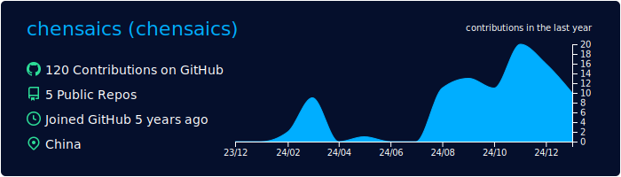
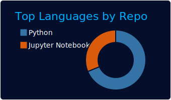
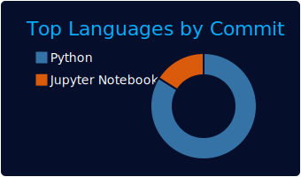
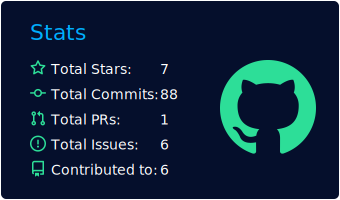
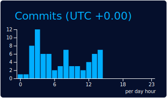

## algolia

[](https://github.com/chensaics)
[](https://github.com/chensaics) [](https://github.com/chensaics)
[](https://github.com/chensaics) [](https://github.com/chensaics)
### Now you can add this to your markdown
```

[](https://github.com/chensaics)
[](https://github.com/chensaics) [](https://github.com/chensaics)
[](https://github.com/chensaics) [](https://github.com/chensaics)

```

### Each card usage
---


```

```

    

---


```

```

    

---


```

```

    

---


```

```

    

---


```

```

    
